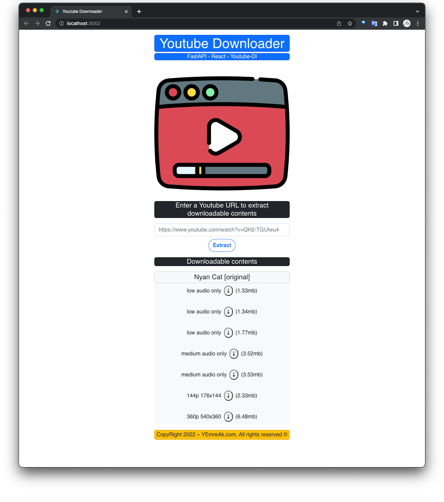

# ↓ Youtube Downloader | React - FastAPI - Youtube-Dl

## Insturactions

- `cd backend && python main.py` to run backend server 
    - `pip install -r requirements.txt` to install dependencies
- `cd frontend && npm start` to run front-end server
    - `npm install axios bootstrap` to install dependencies

> Can't download youtube videos direct due to COR problems, so when download fails redirects you to url!

## 🔗 Resouseces

- https://getbootstrap.com/docs/4.1/utilities/colors/#color
- http://localhost:8000/docs
- https://www.youtube.com/watch?v=oGwszbCH5Z4

## 🪪 License

Copyright 2023 Yunus Emre Ak ~ YEmreAk.com

Licensed under the Apache License, Version 2.0 (the "License");
you may not use this file except in compliance with the License.
You may obtain a copy of the License at

    http://www.apache.org/licenses/LICENSE-2.0

Unless required by applicable law or agreed to in writing, software
distributed under the License is distributed on an "AS IS" BASIS,
WITHOUT WARRANTIES OR CONDITIONS OF ANY KIND, either express or implied.
See the License for the specific language governing permissions and
limitations under the License.
